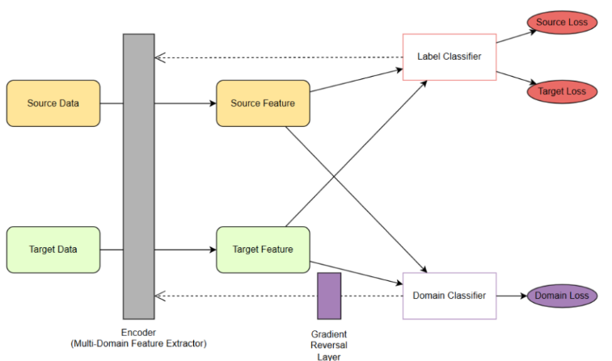

# Sentiment Analysis using Fully Supervised Domain Adversarial Neural Network (DANN)

## Overview
This project implements a sentiment analysis system using a Fully Supervised Domain Adversarial Neural Network (DANN). The approach combines labeled data from both source and target domains to achieve improved classification performance. By leveraging domain adversarial learning and integrating both classification and domain losses, the model learns a unified feature space that generalizes effectively across domains.

## Methodology

### Fully Supervised Domain Adversarial Neural Network
The proposed Fully Supervised DANN model is inspired by:

- **Feature-level Fusion**: Maps both source and target domains into a unified feature space, enabling simultaneous training with labeled data from both domains.
- **Semi-Supervised Domain Adversarial Neural Network (SDANN)**: Utilizes discriminator regularization to train a feature extractor that represents data from both domains.

This approach is tailored for scenarios where the labeled target domain data is sufficient for supervised learning but insufficient for standalone training while ensuring high accuracy. The methodology includes:

1. **Integration of Classification Loss**: Guides the model to learn discriminative features by leveraging labeled data from both domains.
2. **Domain Loss**: Encourages learning of domain-invariant features to improve generalization across domains.
3. **Dual Supervised Loss**: Facilitates better feature representation and improves classification performance, even with limited labeled target domain data.
## Model Architecture

## Advantages
- **Unified Feature Space**: Ensures effective feature representation for both domains.
- **Domain-Invariant Features**: Promotes better generalization across domains.
- **Improved Target Domain Performance**: Enhances classification accuracy even with limited labeled target data.

## Acknowledgments
This project is inspired by the principles of domain adversarial neural networks and leverages the BERT model for feature extraction.

